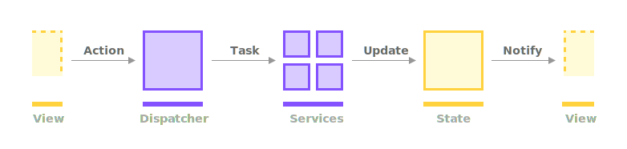

# 

[](https://developer.apple.com/xcode/swiftui)
[](https://swift.org)
[](https://developer.apple.com/xcode)
[](https://opensource.org/licenses/MIT)

Firestarter is a zero-dependency architectural framework that helps you write clean, predictable, testable applications in Swift. Loosely inspired by Redux, it's very lightweight, just a couple of hundreds of lines of code. It can be used as a framework, but can also serve as inspiration for your own Redux-like architecture.

# 

## Index
* [Features](#features)
* [Core Concepts](#core-concepts)
* [Common patterns](#common-patterns)
* [Multi-threading](#multi-threading)
* [SwiftUI example](#swiftui-example)
* [License](#license)

## Features

- expressive, compact and easy to use API
- built for `iOS`, `macOS`, `tvOS`, `macCatalyst`, `watchOS` and `driverKit`
- full middleware support
- zero library dependencies
- supports redirects and deffered calls
- full action history
- works with legacy callbacks, `Combine` and/or `await/async` 
- fully tested

## Core Concepts

There are 4 actors that work together in Firestarter: `Action`s, `Middleware`s, `Reducer`s and the `Dispatcher`. The first 3 are protocols that can be adopted by any `struct`, `class` and even `enum` for actions. The dispatcher is the entry point, the entity that sends actions and triggers the `dispatcher -> pre (middleware) -> reducer -> post (middleware)` processing flow.

### Actions

Actions drive all the other actors. They model all the possible events that your application can handle. Also, once sent, most of them will lead to a state mutation inside the reducers.

 ```swift
 /// An example of 3 actions used to authenticate a user
 enum GatekeeperAction: Action {
     case login(email: String, password: String)
     case logout
     case resetPassword
 }
 ```

### Middlewares

Middlewares are getting called before/after *any* of the reducers start/finish processing an action.

- The `pre(action:)` method is called before the reducers start processing an action and it's mostly used to redirect the action to another action flow.
- The `post(action:)` method is called after all the reducers finished processing the action.
- The `failure(action:, error:)` methods is called when any of the reducers raise an error.

```swift
/// An example of a middleware blocking all user actions until a authenticated user is present 

enum UserAction: Action {
case fetchArticles
case fetchFavs
case update(username: String)
// ...
// `.noop` is a special action that's ignored by everybody
case noop
}

func pre(action: UserAction) throws -> Rewrite<UserAction> {
    if state.user == .unauthenticated {
        return .redirect(to: .single(action: .noop))
    }
}
```

### Reducers

The reducers contain most of the business logic in a Firestarter-architectured app. Each reducer should handle a specific set of tasks that go together well. Like authentication, profile, prefetching, persistance, various (article, users, likes, etc) repositories and so on.
Reducers will ignore most of the actions they receive in `receive(action:)` handling only relevant ones. `receive(action:)` is async in nature (works with legacy callbacks, `Combine` and/or `await/async`) allowing you to offload work to other threads, make network requests or call other async mathods.

```swift
/// A authentication service
class AuthService: Reducer {
    func receive(_ action: TestAction) async throws -> ActionFlow<TestAction> {
        switch action {
        case let .login(username, password):
            // make the server login call, update the app state etc
        case .logout:
            // clear state, reset the dispatcher, remove any user-persisting data etc
        // ...
        }
        
        return .noop
    }
}
```

### The Dispatcher

The dispatcher's main purpose is to send actions (`send(action:)`), starting the process that will make all the other actors react. Beyond that, it also initially registers the reducers and middlewares.

## Common patterns

### Blocking an action

There is no built-in way to block an action, one of the rules Firestarter follows is: once an action is sent, it will always either complete or fail. This is keeping everything consistent and predictable and its very helpful for debugging. However, it's trivial to add a `.noop` action that gets ignored by all your reducers. Redirecting to this `.noop` action in the middleware will behave like you're blocking current the action, however, it also keeps things predictable and consistent as described above. 

```swift
/// Blocking actions when the user is not authenticated
func pre(action: UserAction) throws -> Rewrite<UserAction> {
    // If user is not authenticated, redirect to `.noop` and do nothing
    if state.user == .unauthenticated {
        return .redirect(to: .single(action: .noop))
    }
}
```

### Postponing an action

There is no built-in way to postpone an action, however, just like with blocking actions, one can have a `.postpone(action:)` action that stacks actions in an `ActionFlow` until a certain other action is sent.

```swift
/// Postponing an action until the user is authenticated

var postponedActions: ActionFlow<UserAction> = .noop()

func pre(action: UserAction) throws -> Rewrite<UserAction> {
    switch action.name {
    // If the user logged in, redirect to a flow that contains the initial action, plus all the other actions that were postpone until login
    case .accountReady:
        .redirect(to: action.then(flow: postponedActions))
    default:
        break
    }
    
    // If the user is not authenticated yet, postpone all the actions
    if state.user == .unauthenticated {
        return .redirect(to: .single(action: .postpone(action)))
    }
}

// In the `post(action:)` methods we simply collect all the action that await logging it.
func post(action: TestAction) {
    switch action {
    case let .postpone(other):
        postponedActions = postponedActions.then(other)
    default:
        break
    }
}
```

### Identifying actions by name

When packing actions as `enum`s it's somewhat common to also refer the actions by name only (without the parameters). One way to do it is by having another inner `enum` that maps the action to its name as done in the example below.

```swift
enum UserAction: Action {
    case login(email: String, password: String)
    case logout
    case resetPassword
    
    enum Name: Hashable {
        case login
        case logout
        case resetPassword
    }

    var name: Name {
        switch self {
        case .login: return .login
        case .logout: return .logout
        case .resetPassword: return .resetPassword
        }
    }
}
```

## Multi-threading

Firestarter expects all its methods to be called on the main thread. However, since the `receive(action:)` method of the reducer is async, you can always offload the work to multiple threads as long as you return to the main thread before returning the result (e.g. using `receive(on:)` in `Combine`)

## SwiftUI example

```swift
// Actions.swift
// An enum containing all the actions (events) an app can trigger
enum AppAction: Action {
    case login(email: String, password: String)
    case logout
    case resetPassword
    ...
    case noop
}

// Middleware.swift
// A class that receives all actions before any reducer
// (before the action gets processed) and has the opportunity 
// to redirect it to another action. Like reducers, it has read access 
// to the state, unlike reducers, it should not mutate the state. 
// The middleware is optional.
class Middleware: Middleware {
    let state: AppState
    func pre(action: AppAction) throws -> Rewrite<AppAction> {
        // If the user is not authenticated, we can redirect to `.noop` 
        // which is an action not handled by any of the reducers, 
        // essentially stoping the processing flow.
        if state.user == .unauthenticated {
            return .redirect(to: .single(action: .noop))
        }
    }
}

// AuthService.swift
// The `AuthService` is handling all authentication-related actions. 
// It can offload work to secondary threads, handle business logic, 
// delegate work other modules and so on. Each action handled here usually 
// mutates the state. It returns an action flow if other actions need executing 
// right after the current, or `.noop`. 
class AuthService: Reducer {
    let state: AppState
    func receive(_ action: AppAction) async throws -> ActionFlow<AppAction> {
        switch action {
        case let .login(username, password):
            ...
            // updating the state after login
            state.user == .authenticated(user)
            // make the server login call, update the app state etc
        case .logout:
            // clear state, reset the dispatcher, 
            // remove any user-persisting data etc
        case resetPassword:
            // make the server reset password call
        }
        
        return .noop
    }
}

// App.swift
// Here's where we put everything together and expose 
// the dispatcher and the state to the view tree
@main
struct MyApp: App {
    var body: some Scene {
        let state = AppState() 
        let userViewModel = UserViewModel(state: state)
        let booksViewModel = BooksViewModel(state: state)
        ...
        let dispatcher = Dispatcher()
        let middleware = Middleware(state: state)
        let authService = AuthService(state: state)
        
        dispatcher.register(middleware: middleware)
        dispatcher.register(reducer: authService)

        return WindowGroup {
            AppView()
                .environment(\.dispatcher, dispatcher)
                .environmentObject(userViewModel)
                .environmentObject(booksViewModel)
        }
    }
}
```

## License
[MIT License](LICENSE)
